# Epsilon Token Exchange Platform
This file will guide the user through the steps to set up the Epsilon Exchange Platform.

## Pre-requisite software
- [NPM](https://www.npmjs.com/get-npm)
- [Truffle Ganache](https://www.trufflesuite.com/ganache)
- [Metamask](https://metamask.io/)
- [Docker](https://www.docker.com/products/docker-desktop) 

## Deploying Smart Contract

- Step 1: Install Truffle Framework
```
npm install -g truffle
``` 
- Step 2: Navigate to the Smart Contract Directory (smart-contract/eps-token) and install the requirements
```
npm install
```

- Step 3: Open Ganache and set-up a new workspace, specify the ```truffle-config.js``` file to create a new workspace.

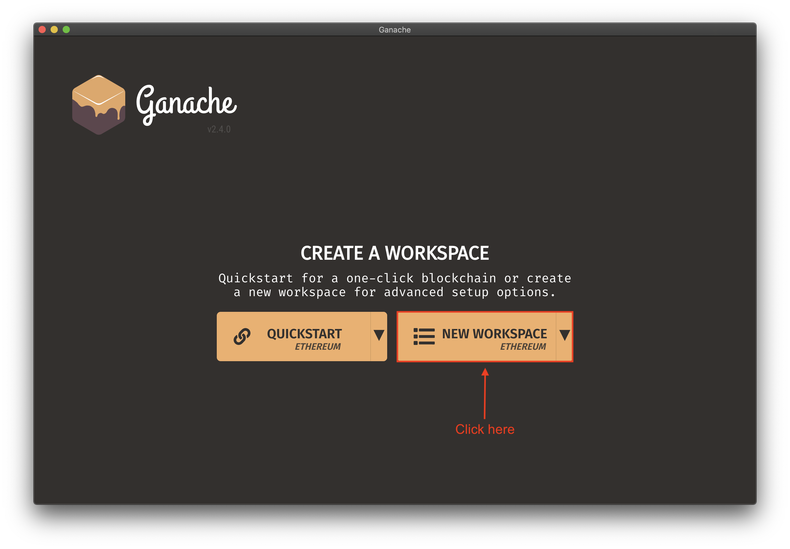

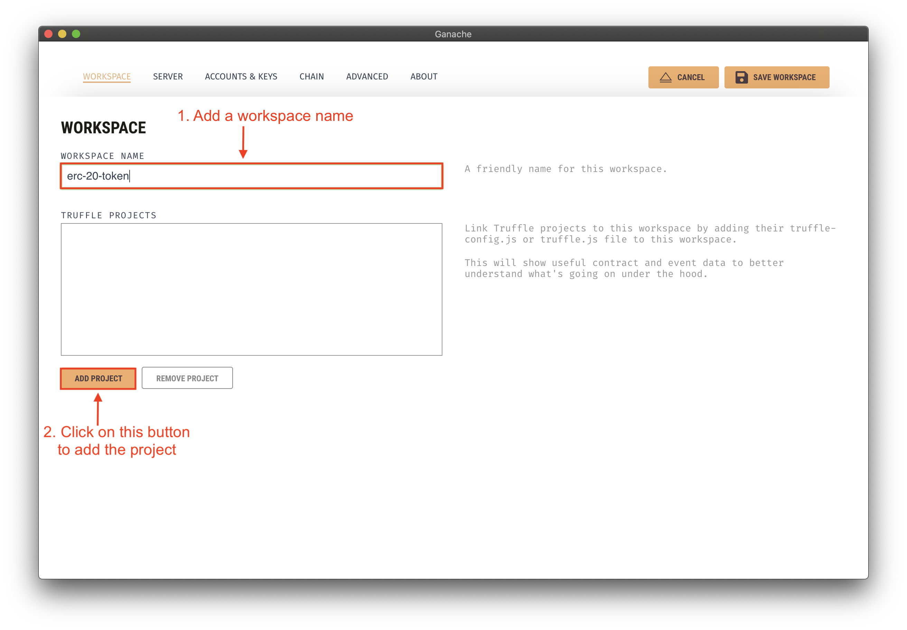

 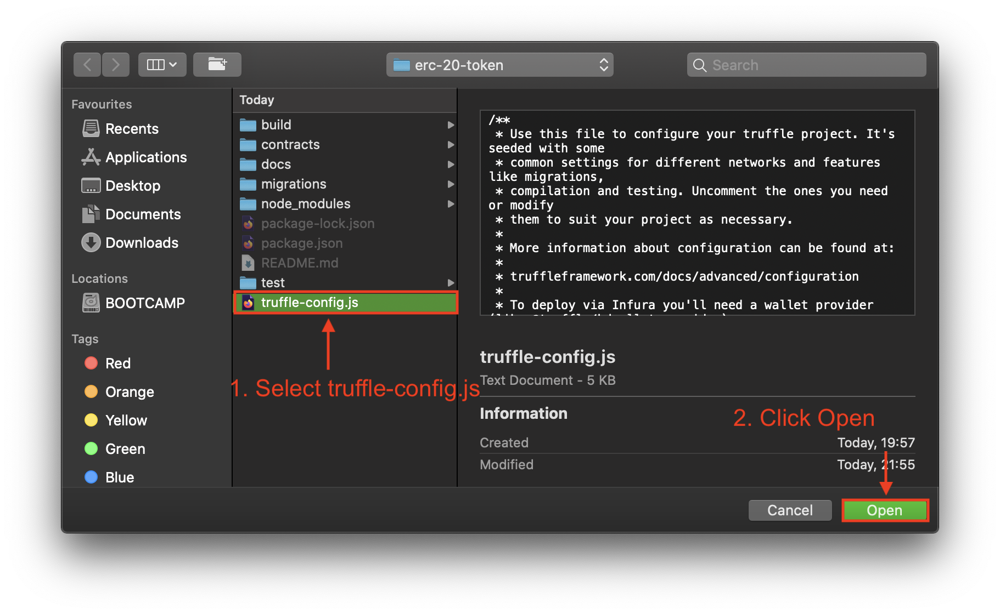

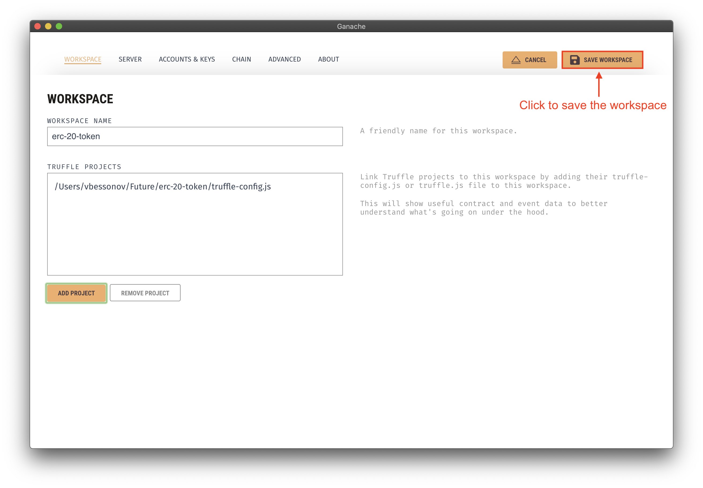


- Step 3: Inside smart contract file ```contracts/EpsToken.sol```, update your wallet address in Line 31. You can use the address of the first account from the Ganache interface.
```
treasury = address(0xc86448c09B84C6b62656c42048952e5612Db542D);
```

- Step 4: Deploy the smart contract
```
truffle deploy
```

Once the smart contract has been deployed, you will be able to see the token in the truffle interface under the contracts tab. Copy the contract address as it will be used later.


## Setup wallet in MetaMask
0. Open chrome and start the MetaMask extension.
1. Choose the set-up custom network option. 
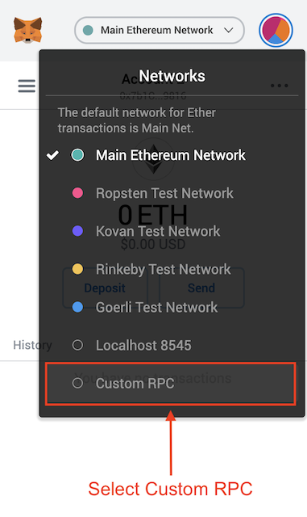
2. Fill in the network details:
* Network name can by anything 
* NEW RPC URL (Ganache URL, eg: 127.0.0.1:7545)
* Chain ID (0x539)
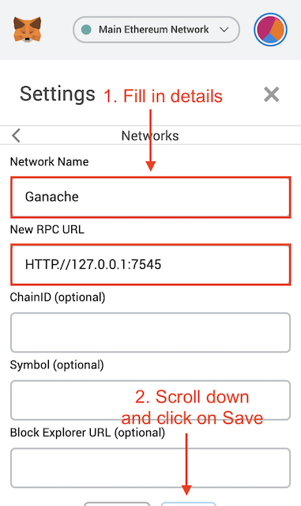

3. Copy deployment account's private key from Ganache:

    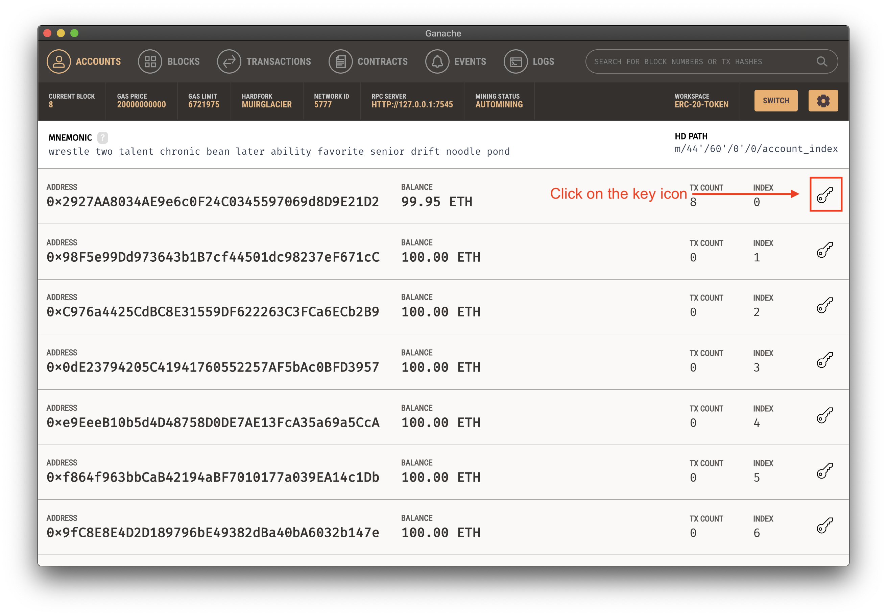

    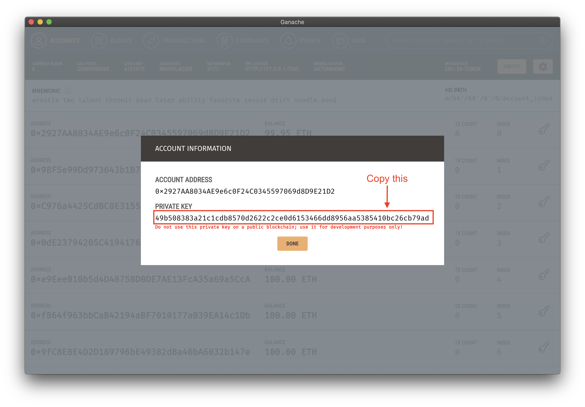

4. Import a new account into Metamask:

    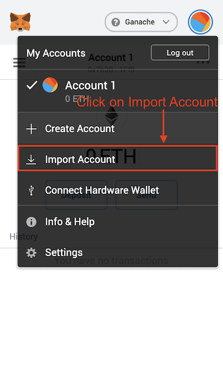

5. Fill in account's details:

    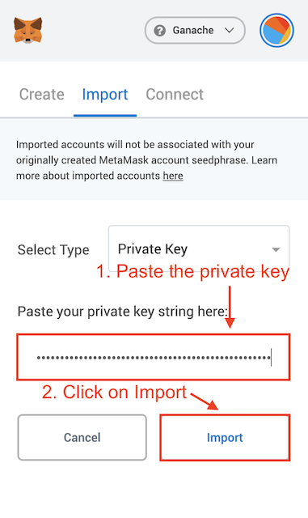

6. Add token contract:

    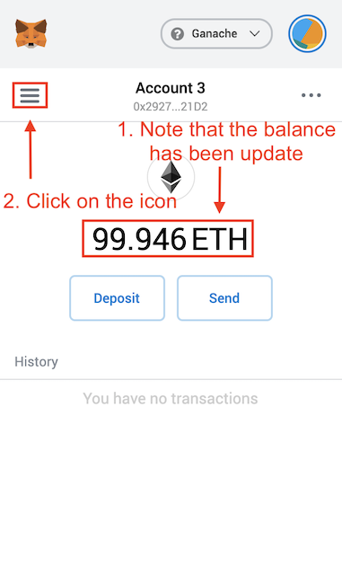
    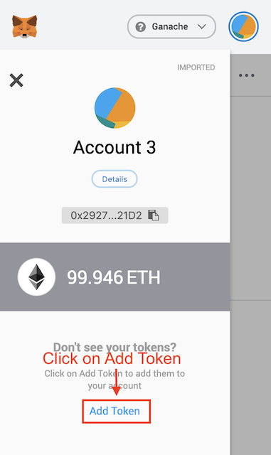

7. Add token contract:

    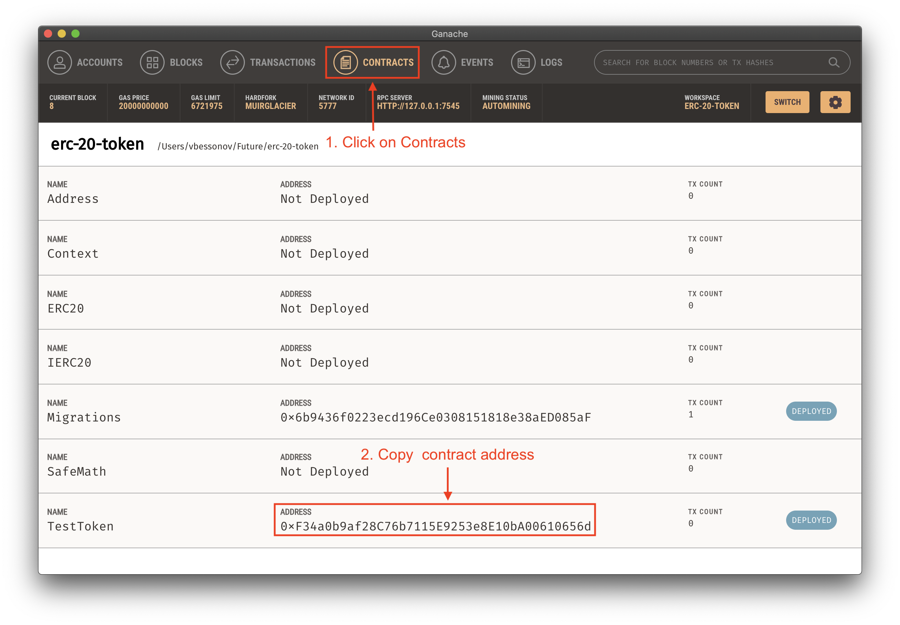

8. <a name="step8"></a>Fill in token contract's details in Metamask:

    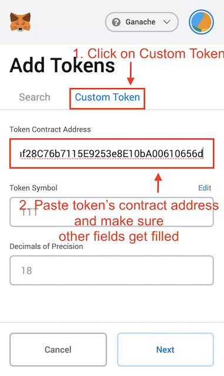

9. Fill in token contract's details in Metamask:

    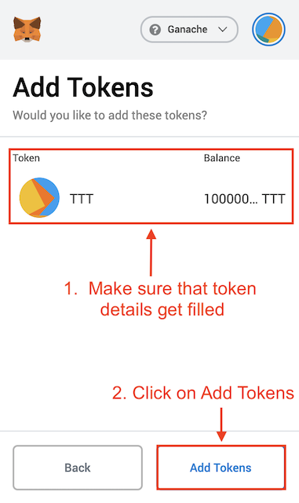

## Starting Exchange Backend

1. Navigate to the directory
 ```
 cd exchange-backend
```
2. Install the required packages
```
npm install 
```
3. Update the ```./src/config.js``` file:
 * ethNetwork is the Ganache Network Address (same as RPC)
 * myAddress is the wallet address for the account containing all the tokens.
 * privateKey is the private key of the account containing all the tokens (available in Ganache).
 * contractAddress is the address of the newly deployed smart contract available in Contracts tab in Ganache.
 * stripeKey is the private stripeKey of the stripe account where money will be transferred.
```
    ethNetwork: "http://127.0.0.1:7545/",
    myAddress: "0xc86448c09B84C6b62656c42048952e5612Db542D",
    contractAddress: '0x9667aef4B026432acbFD07b50dD3Ae3d495B8B44',
    privateKey: new Buffer('8cf5ac3dz2d853dfe02a771bd711ca7de44b82d789d4fa7606c5621dde377a39', 'hex')
```
4. Start the server -> The server should start on port 5000.
```
npm start
```

## Starting the Frontend for Exchange Platform
1. Navigate to frontend server directory
```
cd exchange-frontend
```
2. Build using docker 
```
docker build website -t exchange-frontend
```
3. Run docker image
```
docker run -d -p 8080:80 exchange-frontend
```
4. Access server using the url ```localhost:8080``` in the browser.
5. Enter the details of purchase:
    * Card Information: 4242 4242 4242 4242 4242 + Any values for remaining fields & 5 Digit pincode.
    * You can use another account from Ganache and copy it's address for testing.
6. You can add the same account to MetaMask and the token address to check if the tokens have been transferred!

