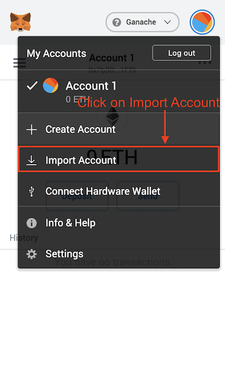

# erc-20-token

A boilerplate project for creating new ERC-20 tokens.

## Testing locally

1. Install [NPM](https://www.npmjs.com/get-npm)
2. Add [Metamask](https://metamask.io/) extension to your browser
3. Install [Truffle](https://www.trufflesuite.com/):

```bash
npm install -g truffle
```

4. Install [Truffle Ganache](https://www.trufflesuite.com/ganache)

5. Clone GitHub repository:

```bash
git clone https://github.com/vbessonov/erc-20-token
cd erc-20-token
```

6. Install Node dependencies using NPM:

```bash
npm install
```

7. Compile contracts using Truffle:

```bash
truffle compile
```

  <details>
    <summary>
      Show output
    </summary>

```bash
Compiling your contracts...
===========================
> Compiling ./contracts/Migrations.sol
> Compiling ./contracts/TestToken.sol
> Compiling openzeppelin-solidity/contracts/GSN/Context.sol
> Compiling openzeppelin-solidity/contracts/math/SafeMath.sol
> Compiling openzeppelin-solidity/contracts/token/ERC20/ERC20.sol
> Compiling openzeppelin-solidity/contracts/token/ERC20/IERC20.sol
> Compiling openzeppelin-solidity/contracts/utils/Address.sol
> Artifacts written to /Users/vbessonov/Future/erc-20-token/build/contracts
> Compiled successfully using:
  - solc: 0.6.2+commit.bacdbe57.Emscripten.clang
```

  </details>

8.  Start Ganache locally:

    1.  Create a new workspace:
        
    2.  Set up a new workspace:
        
    3.  Adding the project to the workspace:
        
    4.  Save workspace's settings:
        

9.  Run tests using Truffle and make sure they succeed:

```bash
truffle test
```

<details>
  <summary>
    Show output
  </summary>

```bash
  Using network 'development'.

# Compiling your contracts...

> Everything is up to date, there is nothing to compile.

    Contract: TestToken
      ✓ should put 100000000 TestToken in the first account (41ms)
      ✓ should have TestToken as its name (63ms)
      ✓ should have TTT as its symbol (38ms)


    3 passing (245ms)
```

  </details>

10. Deploy contracts using Truffle:

```bash
truffle deploy
```

<details>
  <summary>
    Show output
  </summary>

```bash

Compiling your contracts...
===========================
> Everything is up to date, there is nothing to compile.


Starting migrations...
======================
> Network name:    'development'
> Network id:      5777
> Block gas limit: 6721975 (0x6691b7)


1_initial_migration.js
======================

 Deploying 'Migrations'
 ----------------------
 > transaction hash:    0xb6100b0a6c838d4a65cf5d00019c9b69b1492570cd21fc08e143b09744bc781a
 > Blocks: 0            Seconds: 0
 > contract address:    0x6b9436f0223ecd196Ce0308151818e38aED085aF
 > block number:        5
 > block timestamp:     1589052451
 > account:             0x2927AA8034AE9e6c0F24C0345597069d8D9E21D2
 > balance:             99.96969592
 > gas used:            164379 (0x2821b)
 > gas price:           20 gwei
 > value sent:          0 ETH
 > total cost:          0.00328758 ETH


 > Saving migration to chain.
 > Saving artifacts
 -------------------------------------
 > Total cost:          0.00328758 ETH


2_deploy_token.js
=================

 Deploying 'TestToken'
 ---------------------
 > transaction hash:    0x258530a966485cf7ce77c3391a050bc8d8a20dd69b2361a9cf4c0a5414092cc8
 > Blocks: 0            Seconds: 0
 > contract address:    0xF34a0b9af28C76b7115E9253e8E10bA00610656d
 > block number:        7
 > block timestamp:     1589052452
 > account:             0x2927AA8034AE9e6c0F24C0345597069d8D9E21D2
 > balance:             99.94651382
 > gas used:            1116764 (0x110a5c)
 > gas price:           20 gwei
 > value sent:          0 ETH
 > total cost:          0.02233528 ETH


 > Saving migration to chain.
 > Saving artifacts
 -------------------------------------
 > Total cost:          0.02233528 ETH


Summary
=======
> Total deployments:   2
> Final cost:          0.02562286 ETH
```

</details>

11. Setup Metamask extension:

    1. Set up a custom network:

       

    2. Fill in network details:

       

    3. Copy deployment account's private key from Ganache:

       

       

    4. Import a new account into Metamask:

       

    5. Fill in account's details:

       

    6. Add token contract:

       
       

    7. Add token contract:

       

    8. <a name="step8"></a>Fill in token contract's details in Metamask:

       

    9. Fill in token contract's details in Metamask:

       

    10. Make sure that you became a proud owner of `100,000,000 TTT`:

        

## Deploying to Ropsten network

**Prerequisite**: please run all the steps above.

1. Select Ropsten in Metamask and copy your account address:

   

2. Add test Ethereum to your account using [Ropsten Ethereum Facet](https://faucet.ropsten.be/):

   

3. Check status on Etherscan usink the link from Ropsten Ethereum Facet page and wait until it gets confirmed:

   

4. Make sure that your balance was updated:

   

5. [Create a free Infura account](https://infura.io/register)

6. After you created a new account go to [the dashboard](https://infura.io/dashboard/ethereum) and create a new project:

   

7. Setup a new project:

   

8. Update [truffle-config.js](./truffle-config.js) and replace `infuraProjectID` with the project ID you got in step 7

```js
const infuraProjectID = "<YOUR INFURA PROJECT ID>";
```

9. Paste your 12 word mnemonic phrase your used to create your Metamask account to [.secret](./secret)

10. Run the following command:

```bash
truffle deploy --network ropsten
```

<details>
  <summary>
  Show output
  </summary>

```bash

Compiling your contracts...
===========================
> Everything is up to date, there is nothing to compile.


Migrations dry-run (simulation)
===============================
> Network name:    'ropsten-fork'
> Network id:      3
> Block gas limit: 8000000 (0x7a1200)


1_initial_migration.js
======================

   Deploying 'Migrations'
   ----------------------
   > block number:        7902055
   > block timestamp:     1589462851
   > account:             0x7b3Be1c45Dc8534f5F7961Ca4647914df7091Ff9
   > balance:             2.972685862
   > gas used:            149379 (0x24783)
   > gas price:           2 gwei
   > value sent:          0 ETH
   > total cost:          0.000298758 ETH

   -------------------------------------
   > Total cost:         0.000298758 ETH


2_deploy_token.js
=================

   Deploying 'TestToken'
   ---------------------
   > block number:        7902057
   > block timestamp:     1589462875
   > account:             0x7b3Be1c45Dc8534f5F7961Ca4647914df7091Ff9
   > balance:             2.970547652
   > gas used:            1041764 (0xfe564)
   > gas price:           2 gwei
   > value sent:          0 ETH
   > total cost:          0.002083528 ETH

   -------------------------------------
   > Total cost:         0.002083528 ETH


Summary
=======
> Total deployments:   2
> Final cost:          0.002382286 ETH


Starting migrations...
======================
> Network name:    'ropsten'
> Network id:      3
> Block gas limit: 8000029 (0x7a121d)


1_initial_migration.js
======================

   Deploying 'Migrations'
   ----------------------
   > transaction hash:    0x8ce22ef38814151ac86c3bd28711010a5ebb0bb7918941f2ede115f0be7c03b1
   > Blocks: 1            Seconds: 4
   > contract address:    0x95A6E5b234F35aEeb992B6A044A97eA88a3B8717
   > block number:        7902060
   > block timestamp:     1589462896
   > account:             0x7b3Be1c45Dc8534f5F7961Ca4647914df7091Ff9
   > balance:             2.96969704
   > gas used:            164379 (0x2821b)
   > gas price:           20 gwei
   > value sent:          0 ETH
   > total cost:          0.00328758 ETH


   > Saving migration to chain.
   > Saving artifacts
   -------------------------------------
   > Total cost:          0.00328758 ETH


2_deploy_token.js
=================

   Deploying 'TestToken'
   ---------------------
   > transaction hash:    0xb8b2d2d38947cd646c97a0e0be811bb2ff1921462a5eacdea9c21bde85992474
   > Blocks: 1            Seconds: 9
   > contract address:    0x7479A24316Dee45fDA068AAE2cD1F8EF8623e57f
   > block number:        7902064
   > block timestamp:     1589462920
   > account:             0x7b3Be1c45Dc8534f5F7961Ca4647914df7091Ff9
   > balance:             2.94651494
   > gas used:            1116764 (0x110a5c)
   > gas price:           20 gwei
   > value sent:          0 ETH
   > total cost:          0.02233528 ETH


   > Saving migration to chain.
   > Saving artifacts
   -------------------------------------
   > Total cost:          0.02233528 ETH


Summary
=======
> Total deployments:   2
> Final cost:          0.02562286 ETH
```

</details>

11. Find a contract address in the output and add it to Metamask as it was described in [step 8](#step8) of in section `Local testing`

```bash
Deploying 'TestToken'
   ---------------------
   > transaction hash:    0xb8b2d2d38947cd646c97a0e0be811bb2ff1921462a5eacdea9c21bde85992474
   > Blocks: 1            Seconds: 9
   > contract address:    0x7479A24316Dee45fDA068AAE2cD1F8EF8623e57f
```

12. Make sure that you have got new tokens to your account:


